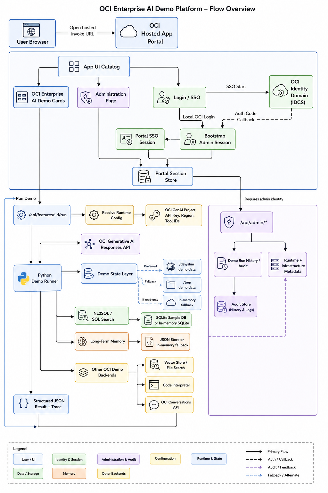

# Enterprise AI Demo Portal

A local portal for OCI Enterprise AI demos. It combines runnable UI cards, Python demo backends, Terraform-provisioned OCI resources, generated runtime metadata, and per-run logs in one workspace.

[](https://cloud.oracle.com/resourcemanager/stacks/create?zipUrl=https://github.com/RahulMR42/oci_enterprise_ai_demo/releases/latest/download/enterprise-ai-demo-resource-manager-stack.zip)

Use the button to create the full OCI Resource Manager stack from the latest GitHub release package. The stack working directory is `infra/resource-manager-demo`. See [docs/deployment/resource-manager-one-click.md](docs/deployment/resource-manager-one-click.md) for required variables, release packaging, and validation steps.

## App Flow



The flow shows how the hosted portal UI, login paths, demo execution API, Python demo runner, state fallbacks, OCI service calls, and administration endpoints fit together.

## Demo Coverage

| Demo | Runtime | Infrastructure |
| --- | --- | --- |
| Responses API | Direct OCI Responses API call through the OpenAI-compatible endpoint | GenAI project and API key |
| Conversation Store | OCI Conversations API state plus OCI Responses API | Shared GenAI project and generated conversation ID |
| Guardrails | Local policy checks plus sanitized OCI call | Shared GenAI project |
| File Search & Vector Store RAG | OCI File Search tool over a provisioned vector store | Vector store and bundled Oracle PDFs |
| Code Interpreter | OCI Code Interpreter tool | Managed code container |
| Function Calling | OCI tool planning plus local typed functions | Shared GenAI project |
| Remote MCP Calling | OCI model plus local MCP-style gateway | Shared GenAI project |
| NL2SQL / SQL Search | OCI SQL generation, SELECT validation, local SQLite execution | ADB and Database Tools resources shown in infra |
| Long-Term Memory | OCI memory extraction plus local durable memory store | Shared GenAI project |
| Multi-Model Routing | OCI route candidates, scoring, and selected answer | Shared GenAI project |
| Hosted Agentic Applications | OCI hosted application and deployment backed by OCIR | OCIR repository, hosted app, hosted deployment |
| LangGraph Hosted Agent | Hosted LangGraph wrapper image | OCIR repository, hosted app, hosted deployment |
| OpenClaw Hosted Gateway | Hosted gateway demo UI with run controls and next steps | OCIR repository, hosted app, hosted deployment |
| Governance Center | Local policy controls, audit event, and OCI reviewer summary | Shared GenAI project and shared IAM visibility |
| Document Understanding + GenAI | Bundled PDF metadata/signals plus OCI document summary | Bundled Oracle PDFs |

## Local Setup

Install dependencies once:

```bash
npm install
python3 -m venv env
env/bin/python -m pip install -r requirements.txt
```

Start the portal without inherited proxy settings:

```bash
env -u http_proxy -u https_proxy -u HTTP_PROXY -u HTTPS_PROXY -u no_proxy -u NO_PROXY \
  PORT=5173 \
  ./bash.sh
```

Open `http://localhost:5173`.

The portal login username is `oci`. The password is generated in `.oci-portal-password` unless `OCI_PORTAL_PASSWORD` or `OCI_PORTAL_PASSWORD_FILE` is set.

## Provision Infrastructure

Provision the shared project, shared IAM, conversation store, vector store, code container, NL2SQL resources, and hosted applications before startup:

```bash
env -u http_proxy -u https_proxy -u HTTP_PROXY -u HTTPS_PROXY -u no_proxy -u NO_PROXY \
  PROVISION_INFRA=true \
  PROVISION_DEMOS=conversation-store,file-search-vector-store-rag,code-interpreter,nl2sql-sql-search,hosted-agentic-applications \
  PORT=5173 \
  ./bash.sh
```

Common variables:

| Variable | Default | Purpose |
| --- | --- | --- |
| `OCI_GENAI_COMPARTMENT_ID` | repo default compartment | Target compartment |
| `OCI_GENAI_REGION` | `us-chicago-1` | OCI region |
| `OCI_PROFILE` | `DEFAULT` | OCI CLI profile |
| `RESOURCE_SUFFIX` | generated or existing Terraform output | Stable suffix for demo resources |
| `PROVISION_DEMOS` | conversation/vector/code/NL2SQL/hosted modules | Comma-separated demo modules to apply |
| `REQUIRE_DEMO_INFRA` | `true` | Stop startup when a selected demo module fails |
| `OCI_HOSTED_APP_IDCS_DOMAIN_URL` | unset | Existing identity domain URL for hosted app inbound auth |
| `OCI_HOSTED_APP_IDCS_AUDIENCE` | unset | OAuth audience for hosted app inbound auth |
| `OCI_HOSTED_APP_IDCS_SCOPE` | unset | OAuth scope |
| `OCI_HOSTED_APP_CONTAINER_CLI` | `podman` | Container CLI for OCIR build/push |
| `OCI_HOSTED_APP_OCIR_REGION_KEY` | `ord` | OCIR region key used in image URIs |

When running behind a corporate proxy, keep proxy variables out of the portal process unless they are known to resolve from the current network. The server strips proxy variables from Python demo child processes so live OCI Responses calls do not fail because of stale shell proxy settings.

### Resource Manager deployment

Use `infra/resource-manager-demo` for the Resource Manager working directory when deploying the full demo from OCI. That stack covers the Terraform demo modules, shared IAM policy, OCIR repositories, OCI DevOps build pipeline, hosted deployments, generated runtime metadata, and the Enterprise AI portal hosted application.

The Resource Manager flow uses OCI DevOps to clone the selected GitHub branch, seed the OCI DevOps repository, build the portal image plus selected hosted images, deliver selected image artifacts to OCIR, and run selected hosted application deployment stages with resource principal auth. It does not require local OCI CLI credentials inside Resource Manager. Use `APP_DEPLOY=all` to replace every DevOps-built hosted app, or leave it empty and enable only the needed `OCI_HA_*_DEPLOY` switches. The portal image is always built and delivered so the portal container redeploys after each DevOps build run and receives the latest hosted app exports.

After apply, use the stack outputs `portal_url`, `portal_login_user`, `portal_login_password`, `devops_hosted_image_build_run_id`, `devops_hosted_deployment_exports`, and `devops_hosted_image_repository_uris` to validate the portal and hosted demos.

## Logs

Startup logs are written to `logs/enterprise-ai-demo-YYYYMMDD-HHMMSS.log` by default. Disable file capture with:

```bash
LOG_CAPTURE_ENABLED=false PORT=5173 ./bash.sh
```

Run Demo requests also write structured JSON logs under `logs/demos/<feature-id>/` and print concise lifecycle lines to the server console.

## Cleanup

Destroy demo modules, shared IAM, and the shared Responses API module:

```bash
env -u http_proxy -u https_proxy -u HTTP_PROXY -u HTTPS_PROXY -u no_proxy -u NO_PROXY \
  DESTROY_INFRA=true \
  PORT=5173 \
  ./bash.sh
```

## Validate Before Push

```bash
npm run build
npm test
terraform -chdir=infra/hosted-agentic-applications fmt -check
```

## Version Bumps

Use the version helper so the browser-visible app manifest, npm metadata, and lockfile stay in sync:

```bash
npm run version:set -- 0.0.16
npm test
```

The portal reads the displayed version from `src/version.json`. `package.json` still keeps npm's required static `version` field, and `tests/version.test.js` fails if the files drift.

Do not commit local runtime state, generated Terraform directories, tfvars, API keys, portal passwords, logs, Python bytecode, or `backend/data/` demo stores. These are ignored for new files, but already tracked local state should be reviewed before staging.

## Architecture

See [docs/architecture.md](docs/architecture.md) for the application architecture, provisioning flow, and demo execution model.
