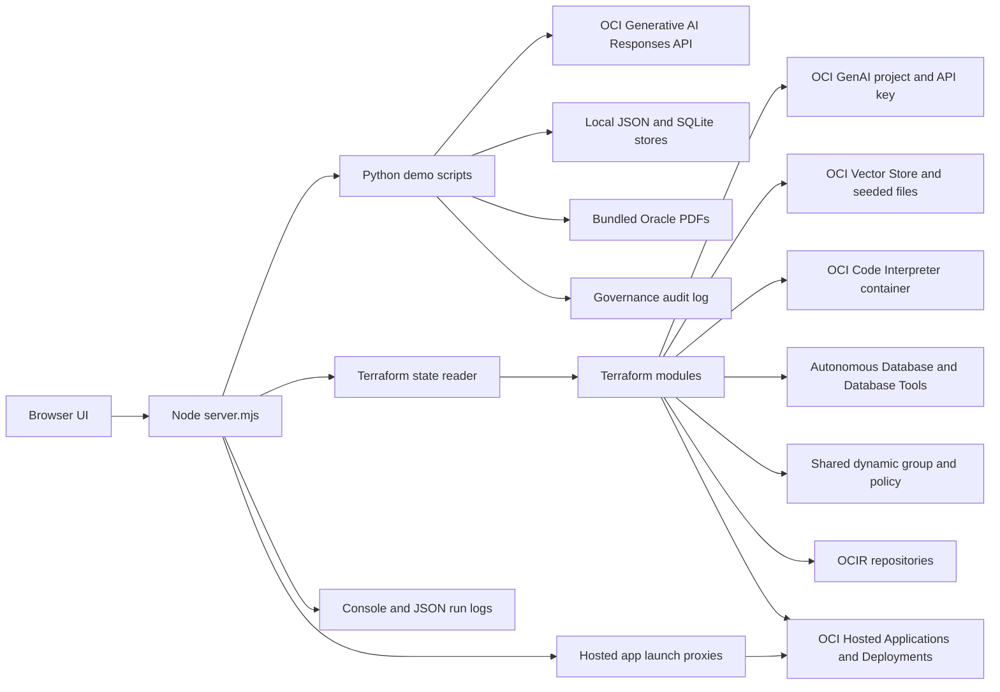
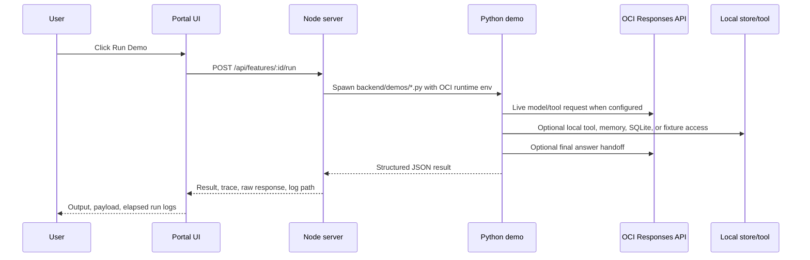

# Enterprise AI Demo Portal Architecture

## Purpose

The portal is a local-first demo shell for OCI Enterprise AI use cases. It keeps UI cards, demo execution, Terraform provisioning, generated runtime IDs, and logs in one repo so every card can show both the business workflow and the OCI resources behind it.

## System View

## Runtime Request Flow

The server removes inherited `http_proxy`, `https_proxy`, `HTTP_PROXY`, `HTTPS_PROXY`, `no_proxy`, and `NO_PROXY` variables from Python demo child processes. OCI region, project ID, API key, vector store ID, and code container ID are still injected from the request, environment, or generated Terraform metadata.

## Hosted Launch Flow

Hosted application cards use local launch proxies:

| Path | Target |
| --- | --- |
| `/api/openclaw/launch/` | Hosted OpenClaw gateway demo UI |

The proxies keep the portal session local, rewrite root-relative UI assets where needed, and surface hosted application launch failures as structured portal errors.

## Provisioning Flow

`bash.sh` is the startup orchestrator. When `PROVISION_INFRA=true`, it applies Terraform in this order:

1. `infra/responses-api`: creates or discovers the shared OCI Generative AI project and API key.
2. `infra/shared-demo-security`: creates shared IAM resources in the target compartment.
3. Selected demo modules from `PROVISION_DEMOS`, commonly:
   - `infra/file-search-vector-store-rag`
   - `infra/code-interpreter`
   - `infra/nl2sql-sql-search`
   - `infra/hosted-agentic-applications`

Generated runtime metadata is exported before the Node server starts:

| Runtime metadata | Source |
| --- | --- |
| `OCI_GENAI_VECTOR_STORE_ID` | `infra/file-search-vector-store-rag/.terraform/generated/vector_store.json` |
| `OCI_GENAI_CODE_INTERPRETER_CONTAINER` | `infra/code-interpreter/.terraform/generated/container.json` |
| Hosted agent metadata | `infra/hosted-agentic-applications/.terraform/generated/hosted_agent.json` |
| LangGraph hosted metadata | `infra/hosted-agentic-applications/.terraform/generated/langgraph_hosted_agent.json` |
| Hosted UI launch client metadata | `infra/hosted-agentic-applications/.terraform/generated/hosted_app_idcs_client.json` |
| OpenClaw hosted metadata | `infra/hosted-agentic-applications/.terraform/generated/openclaw_hosted_gateway.json` |

The infrastructure pane reads Terraform state and generated runtime resources, then merges them into one status view for project, API key, vector store, seeded files, code container, ADB, Database Tools, shared IAM, OCIR repositories, hosted applications, hosted deployments, and hosted deployment artifacts.

## Demo Execution Model

Each runnable card maps to one Python script in `backend/demos/`.

| Feature | Script | Execution model |
| --- | --- | --- |
| Responses API | `responses_api.py` | Direct live OCI Responses API call |
| Conversation Store | `conversation_store.py` | OCI Conversations API state plus live OCI call |
| Guardrails | `guardrails.py` | Local policy check plus optional sanitized live OCI call |
| File Search & Vector Store RAG | `file_search_vector_store_rag.py` | Live OCI File Search tool against provisioned vector store |
| Code Interpreter | `code_interpreter.py` | Live OCI Code Interpreter tool with managed container |
| Function Calling | `function_calling.py` | Live tool planning, local typed function execution, live final response |
| Remote MCP Calling | `remote_mcp_calling.py` | Live tool selection plus local MCP-compatible JSON-RPC gateway |
| NL2SQL / SQL Search | `nl2sql_sql_search.py` | Live SQL generation, SELECT-only validation, bundled SQLite execution |
| Long-Term Memory | `long_term_memory.py` | Live memory extraction, local durable JSON memory, live answer |
| Multi-Model Routing | `multi_model_routing.py` | Live route candidates, policy scoring, selected response |
| Hosted Agentic Applications | `hosted_agentic_applications.py` | Hosted application/deployment metadata plus live invocation response |
| LangGraph Hosted Agent MCP | `langgraph_hosted_agent_mcp.py` | Hosted LangGraph metadata plus live OCI response |
| A2A Agent Collaboration | `a2a_agent_collaboration.py` | Agent handoff planning and live OCI response |
| Agentic RAG Planner | `agentic_rag_planner.py` | Grounded planning prompt plus live OCI response |
| Human Approval Agent | `human_approval_agent.py` | Approval-gated prompt path plus live OCI response |
| Governance Center | `governance_center.py` | Local policy evaluation, audit event persistence, live reviewer summary |
| Document Understanding + GenAI | `document_understanding_genai.py` | Bundled PDF metadata/signals plus live document-grounded summary |
| Batch Inference | `batch_inference.py` | Batch-style prompt manifest summarized through OCI Responses |
| Model Evaluation | `model_evaluation.py` | Evaluation rubric and cases scored through OCI Responses |
| Multimodal Vision | `multimodal_vision.py` | Visual context manifest summarized through OCI Responses |
| AI Workflow Orchestration | `ai_workflow_orchestration.py` | Workflow plan summarized through OCI Responses |

## Data And Offline Assets

The repo can run in restricted environments after dependencies and bundled assets are present.

| Asset | Location | Used by |
| --- | --- | --- |
| Oracle PDFs | `infra/file-search-vector-store-rag/assets/pdfs/` | Vector store seeding |
| Conversation session mapping | `backend/data/conversation_store.json` | Conversation Store |
| Long-term memory | `backend/data/long_term_memory_store.json` | Long-Term Memory |
| SQL sample DB | `backend/data/sql_search_sample.sqlite` | NL2SQL / SQL Search |
| Governance audit log | `backend/data/governance_audit_log.json` | Governance Center |

`backend/data/` is local runtime state and should not be committed. The NL2SQL Terraform module provisions ADB and Database Tools connections for infrastructure realism, while the runnable SQL path executes against bundled SQLite data for deterministic local demos.

## Logging

File logging is enabled by default in `bash.sh` and writes to `logs/`. Set `LOG_CAPTURE_ENABLED=false` to keep logs only in the console. Run Demo execution also writes structured logs under `logs/demos/<feature-id>/` and records:

- feature id
- Python script
- configured runtime resources
- success or failure
- elapsed milliseconds
- structured stdout/stderr payloads

## Cleanup Model

`DESTROY_INFRA=true ./bash.sh` destroys demo modules first, then shared IAM, then the shared Responses API module. This keeps dependency order explicit and provides one command to clean the environment.
